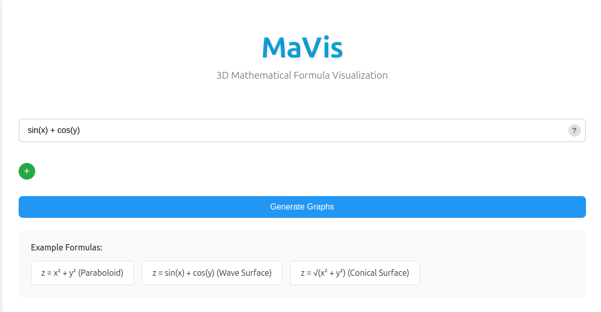
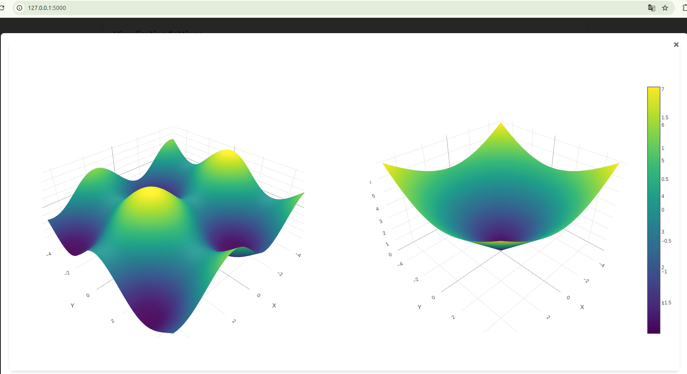

# MaVis - 3D数学公式可视化工具

简体中文 | [English](README_EN.md)



这是一个基于Flask的Web应用程序，可以将数学公式转换为交互式3D可视化图形。用户可以输入多个数学公式，系统会实时生成对应的3D图形，并支持历史记录管理。

## 功能特点

- 支持任意包含x和y变量的数学公式的3D可视化
- 支持多函数同时输入和对比分析
  - 可以动态添加多个函数输入框
  - 提供两种显示模式：
    - 所有函数叠放显示：在同一个3D空间中显示所有函数，方便直观对比
    - 每个函数单独显示：每个函数独立显示在单独的3D空间中，便于详细观察
- 交互式3D图形展示，支持旋转、缩放和平移
- 公式历史记录保存和管理
- 支持一键复用历史公式
- 内置常用公式示例
- 响应式设计，适配各种设备

## 效果展示

### 单函数可视化


### 多函数对比显示


### 可视化设置
您可以通过设置面板调整各种参数：


## 快速开始

1. 启动应用后，访问主页面
2. 在输入框中输入数学公式，例如：`x**2 + y**2`
3. 需要添加更多公式时，点击"+"按钮添加新的输入框
4. 在可视化设置中选择显示模式：
   - Show All Functions Together：所有函数在同一空间显示
   - Show Each Function Separately：每个函数单独显示
5. 点击"Generate Graphs"按钮或按回车键
6. 3D图形将会显示在下方
7. 可以使用鼠标进行以下操作：
   - 左键拖动：旋转视角
   - 右键拖动：平移视角
   - 滚轮：缩放视图

## 支持的数学表达式

### 输入格式要求

1. 变量名要求
   - 必须使用 `x` 和 `y` 作为变量名
   - 变量名区分大小写，必须使用小写
   - 公式必须同时包含这两个变量
   - 不支持其他变量名（如 a, b, z 等）

2. 运算符
   - 加法：`+`
   - 减法：`-`
   - 乘法：必须使用 `*`（不能省略，如 `2x` 要写成 `2*x`）
   - 除法：`/`
   - 幂运算：`**`（如 x² 要写成 `x**2`）
   - 支持括号：`()`（用于控制运算优先级）

3. 支持的数学函数
   - 三角函数：`sin(x)`, `cos(x)`, `tan(x)`
   - 反三角函数：`asin(x)`, `acos(x)`, `atan(x)`
   - 双曲函数：`sinh(x)`, `cosh(x)`, `tanh(x)`
   - 指数和对数：`exp(x)`, `log(x)`（自然对数）, `log10(x)`
   - 平方根：`sqrt(x)`
   - 绝对值：`abs(x)`

4. 常数
   - 使用小数点：`0.5`, `2.0` 等
   - 科学记数法：`1e-3`, `2e5` 等
   - π：可以使用 `pi`
   - 自然对数的底数 e：可以使用 `E`

### 正确的公式示例
```
x**2 + y**2                    # 抛物面
sin(x) + cos(y)                # 波浪面
sqrt(x**2 + y**2)              # 圆锥面
exp(-((x**2 + y**2)/2))       # 高斯钟面
sin(sqrt(x**2 + y**2))        # 水波纹
2*x**2 - 3*y**2               # 马鞍面
pi*sin(x)*cos(y)              # 周期性波浪
log(x**2 + y**2 + 1)          # 对数面
abs(x) + abs(y)               # 金字塔
```

### 多函数组合示例
```
x**2 + y**2 与 2*x**2 + 2*y**2          # 比较不同系数的抛物面
sin(x) + cos(y) 与 sin(2*x) + cos(2*y)  # 比较不同频率的波浪
x**2 - y**2 与 x**2 + y**2              # 比较马鞍面和抛物面
```

### 常见错误示例及修正
```
错误示例               正确写法             说明
2x + y              2*x + y             乘法必须使用 *
x^2 + y^2          x**2 + y**2         幂运算必须使用 **
X + Y              x + y               变量必须使用小写
sin x              sin(x)              函数必须使用括号
x²                 x**2                必须使用 ** 表示幂
z = x + y          x + y               不需要写 z =
```

### 注意事项
- 公式计算范围默认在 [-5, 5] 之间
- 避免在计算范围内出现无意义的值（如除以零）
- 复杂公式的计算可能需要较长时间
- 如果公式出错，系统会返回错误信息

## 安装步骤

1. 克隆仓库：
```bash
git clone https://github.com/ZeyuPing/MaVis.git
cd MaVis
```

2. 安装Miniconda（如果尚未安装）：

对于 Windows：
- 访问 [Miniconda官网](https://docs.conda.io/en/latest/miniconda.html)
- 下载并运行 Windows 安装程序（.exe文件）
- 按照安装向导完成安装

对于 macOS：
```bash
# Intel芯片
brew install miniconda
# 或使用curl下载安装脚本
curl -O https://repo.anaconda.com/miniconda/Miniconda3-latest-MacOSX-x86_64.sh
bash Miniconda3-latest-MacOSX-x86_64.sh

# Apple Silicon (M1/M2)芯片
curl -O https://repo.anaconda.com/miniconda/Miniconda3-latest-MacOSX-arm64.sh
bash Miniconda3-latest-MacOSX-arm64.sh
```

对于 Linux：
```bash
wget https://repo.anaconda.com/miniconda/Miniconda3-latest-Linux-x86_64.sh
bash Miniconda3-latest-Linux-x86_64.sh
```

3. 创建并激活Conda环境：

Windows：
```bash
# 打开Anaconda Prompt或PowerShell
conda create -n mavis python=3.10
conda activate mavis
```

macOS/Linux：
```bash
# 确保conda命令可用（可能需要重新打开终端）
source ~/.bashrc  # Linux
source ~/.zshrc   # macOS
# 创建并激活环境
conda create -n mavis python=3.10
conda activate mavis
```

4. 安装依赖：
```bash
pip install -r requirements.txt
```

5. 运行应用：
```bash
python app.py
```

6. 访问应用：
打开浏览器访问 http://localhost:5000

## 技术栈

- 后端：Flask (Python)
- 前端：HTML5, CSS3, JavaScript
- 数据可视化：Plotly.js
- 数学计算：NumPy, SymPy
- 数据存储：SQLite3

## 依赖项

- Flask==3.0.2
- numpy==1.26.4
- matplotlib==3.8.3
- pandas==2.2.1
- scipy==1.12.0
- Pillow==10.2.0
- plotly==5.19.0
- sympy==1.12

--------------------- 以下内容面向开发者 ---------------------

## 项目结构
```
MaVis/
├── app.py              # Flask应用主文件
├── requirements.txt    # 项目依赖
├── formulas.db        # SQLite数据库文件
├── exsample_figs/     # 示例图片目录
│   ├── exsample.png     # 单函数示例图
│   ├── multi_function.png # 多函数对比图
│   ├── settings.png      # 设置面板图
│   └── title.png        # 标题图
├── static/
│   ├── script.js      # 前端JavaScript
│   └── style.css      # 样式表
└── templates/
    └── index.html     # 主页面模板
```

## API 接口说明

### 1. 主页面渲染 (index函数)
- URL：`/`
- HTTP方法：`GET`
- 功能：渲染应用程序主页面
- 实现函数：`app.py` 中的 `index()`
- 返回：渲染后的 `index.html` 页面

### 2. 生成3D图形 (plot函数)
- URL：`/plot`
- HTTP方法：`POST`
- 功能：根据提供的公式生成3D图形数据
- 实现函数：`app.py` 中的 `plot()`
- 请求体：
  ```json
  {
    "formula": "数学公式字符串"
  }
  ```
- 处理流程：
  1. 接收前端发送的公式
  2. 调用 `create_3d_plot()` 生成图形数据
  3. 将图形数据转换为Plotly格式
- 返回：JSON格式的Plotly图形数据

### 3. 获取历史记录 (get_history函数)
- URL：`/history`
- HTTP方法：`GET`
- 功能：获取所有已保存的公式记录
- 实现函数：`app.py` 中的 `get_history()`
- 处理流程：
  1. 查询SQLite数据库中的历史记录
  2. 将记录转换为JSON格式
- 返回：
  ```json
  [
    {
      "id": "记录ID",
      "formula": "公式内容",
      "created_at": "创建时间"
    }
  ]
  ```

### 4. 删除历史记录 (delete_formula函数)
- URL：`/delete/<formula_id>`
- HTTP方法：`DELETE`
- 功能：删除指定ID的公式记录
- 实现函数：`app.py` 中的 `delete_formula(formula_id)`
- 处理流程：
  1. 接收要删除的记录ID
  2. 从数据库中删除对应记录
- 返回：
  ```json
  {
    "success": true,
    "message": "记录删除成功"
  }
  ```

## 开发指南

### 添加新功能

1. 后端扩展
- 在 `app.py` 中添加新的路由和处理函数
- 使用 `create_3d_plot()` 函数处理新的图形生成需求

2. 前端扩展
- 在 `script.js` 中添加新的交互功能
- 在 `style.css` 中添加新的样式
- 在 `index.html` 中添加新的页面元素

## 注意事项

1. 性能考虑
- 复杂的数学表达式可能需要较长处理时间
- 点数过多会影响渲染性能，默认设置为50x50个点
- 建议在开发环境下不要使用过大的计算范围

2. 安全考虑
- 系统会验证输入的数学表达式
- 使用 `sympify` 进行安全的表达式解析
- 数据库操作使用参数化查询防止SQL注入

## 贡献指南

1. Fork 项目仓库
2. 创建特性分支 (`git checkout -b feature/AmazingFeature`)
3. 提交更改 (`git commit -m 'Add some AmazingFeature'`)
4. 推送到分支 (`git push origin feature/AmazingFeature`)
5. 提交 Pull Request

## 许可证

本项目采用 MIT 许可证