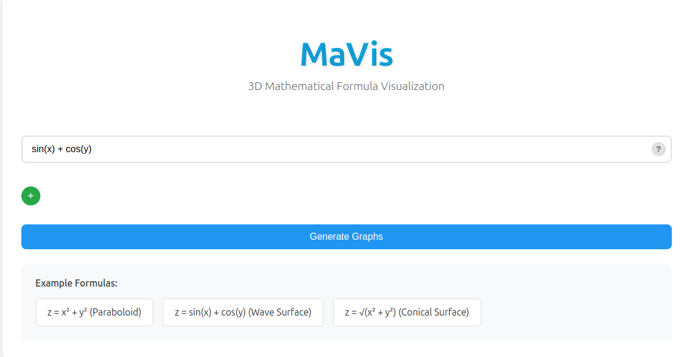
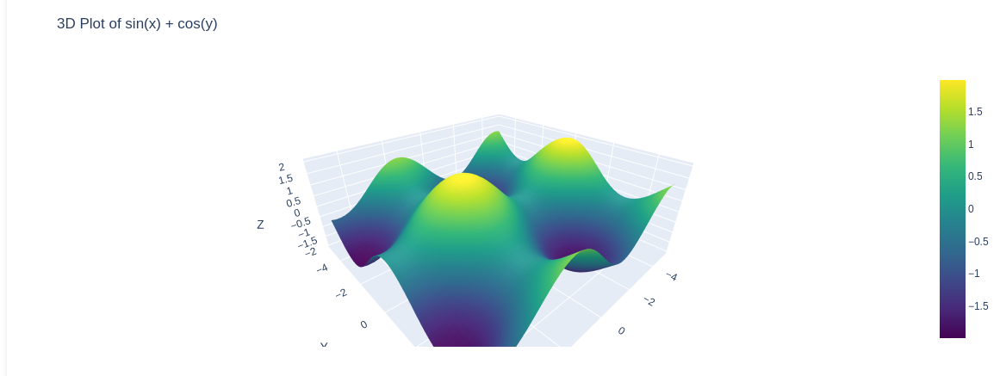
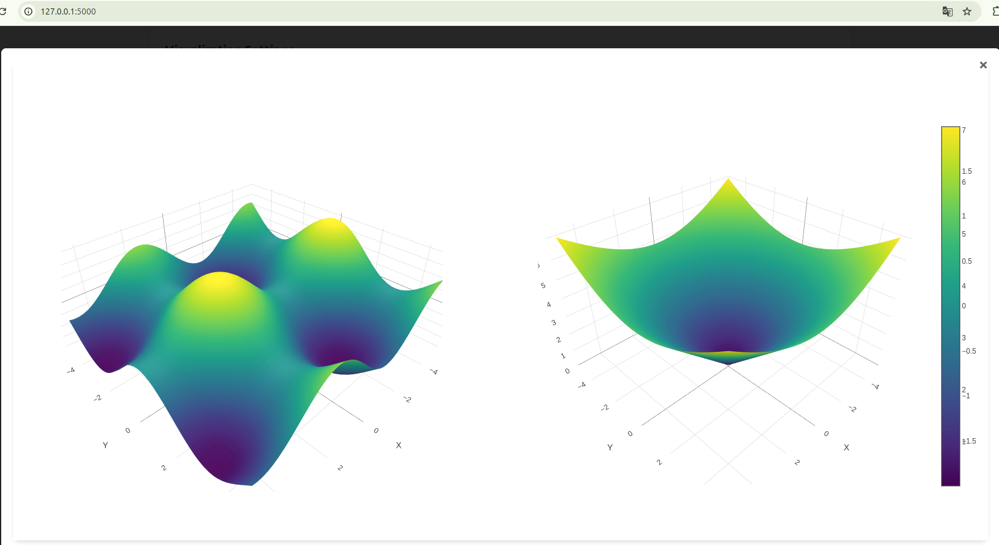
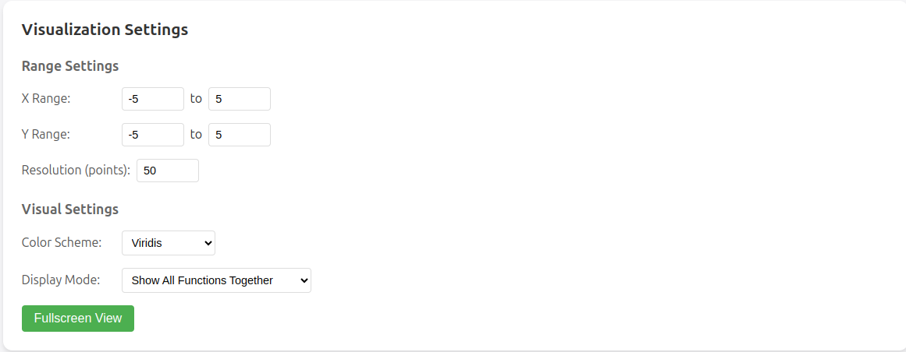

# MaVis - 3D Mathematical Formula Visualization Tool

[简体中文](README.md) | English



A Flask-based web application that converts mathematical formulas into interactive 3D visualizations. Users can input multiple mathematical formulas, and the system will generate corresponding 3D graphs in real-time, with support for history management.

## Features

- Support for 3D visualization of any mathematical formula containing x and y variables
- Multiple function input and comparison analysis
  - Dynamically add multiple function input boxes
  - Two display modes available:
    - Show All Functions Together: Display all functions in the same 3D space for intuitive comparison
    - Show Each Function Separately: Display each function in its own 3D space for detailed observation
- Interactive 3D graphics with rotation, zoom, and pan capabilities
- Formula history management
- One-click reuse of historical formulas
- Built-in common formula examples
- Responsive design for various devices

## Quick Start

1. After launching the application, visit the main page
2. Enter a mathematical formula in the input box, e.g., `x**2 + y**2`
3. To add more formulas, click the "+" button to add new input boxes
4. In Visualization Settings, choose your display mode:
   - Show All Functions Together: All functions in one 3D space
   - Show Each Function Separately: Each function in its own space
5. Click the "Generate Graphs" button or press Enter
6. The 3D graph(s) will be displayed below
7. Use mouse controls:
   - Left-click drag: Rotate view
   - Right-click drag: Pan view
   - Scroll wheel: Zoom view

## Supported Mathematical Expressions

### Input Format Requirements

1. Variable Names
   - Must use `x` and `y` as variable names
   - Variable names are case-sensitive and must be lowercase
   - Formula must contain both variables
   - Other variable names (like a, b, z) are not supported

2. Operators
   - Addition: `+`
   - Subtraction: `-`
   - Multiplication: must use `*` (cannot be omitted, e.g., `2x` should be written as `2*x`)
   - Division: `/`
   - Power: `**` (e.g., x² should be written as `x**2`)
   - Parentheses: `()` (for controlling operation precedence)

3. Supported Mathematical Functions
   - Trigonometric: `sin(x)`, `cos(x)`, `tan(x)`
   - Inverse trigonometric: `asin(x)`, `acos(x)`, `atan(x)`
   - Hyperbolic: `sinh(x)`, `cosh(x)`, `tanh(x)`
   - Exponential and logarithmic: `exp(x)`, `log(x)` (natural logarithm), `log10(x)`
   - Square root: `sqrt(x)`
   - Absolute value: `abs(x)`

4. Constants
   - Decimal points: `0.5`, `2.0`, etc.
   - Scientific notation: `1e-3`, `2e5`, etc.
   - π: use `pi`
   - Base of natural logarithm e: use `E`

### Correct Formula Examples
```
x**2 + y**2                    # Paraboloid
sin(x) + cos(y)                # Wave surface
sqrt(x**2 + y**2)              # Conical surface
exp(-((x**2 + y**2)/2))       # Gaussian bell
sin(sqrt(x**2 + y**2))        # Ripple
2*x**2 - 3*y**2               # Saddle
pi*sin(x)*cos(y)              # Periodic waves
log(x**2 + y**2 + 1)          # Logarithmic surface
abs(x) + abs(y)               # Pyramid
```

### Multiple Function Comparison Examples
```
x**2 + y**2 and 2*x**2 + 2*y**2          # Compare paraboloids with different coefficients
sin(x) + cos(y) and sin(2*x) + cos(2*y)  # Compare waves with different frequencies
x**2 - y**2 and x**2 + y**2              # Compare saddle and paraboloid
```

### Common Errors and Corrections
```
Wrong                 Correct             Explanation
2x + y              2*x + y             Multiplication must use *
x^2 + y^2          x**2 + y**2         Power must use **
X + Y              x + y               Variables must be lowercase
sin x              sin(x)              Functions must use parentheses
x²                 x**2                Must use ** for power
z = x + y          x + y               Don't write z =
```

### Important Notes
- Formula calculation range is [-5, 5] by default
- Avoid undefined values in the calculation range (like division by zero)
- Complex formulas may require longer processing time
- System will return error messages if the formula is invalid

## Installation

1. Clone repository:
```bash
git clone https://github.com/ZeyuPing/MaVis.git
cd MaVis
```

2. Install Miniconda (if not already installed):

For Windows:
- Visit [Miniconda website](https://docs.conda.io/en/latest/miniconda.html)
- Download and run Windows installer (.exe file)
- Follow installation wizard

For macOS:
```bash
# For Intel chips
brew install miniconda
# Or download installation script
curl -O https://repo.anaconda.com/miniconda/Miniconda3-latest-MacOSX-x86_64.sh
bash Miniconda3-latest-MacOSX-x86_64.sh

# For Apple Silicon (M1/M2)
curl -O https://repo.anaconda.com/miniconda/Miniconda3-latest-MacOSX-arm64.sh
bash Miniconda3-latest-MacOSX-arm64.sh
```

For Linux:
```bash
wget https://repo.anaconda.com/miniconda/Miniconda3-latest-Linux-x86_64.sh
bash Miniconda3-latest-Linux-x86_64.sh
```

3. Create and activate Conda environment:

Windows:
```bash
# Open Anaconda Prompt or PowerShell
conda create -n mavis python=3.10
conda activate mavis
```

macOS/Linux:
```bash
# Ensure conda command is available (may need to restart terminal)
source ~/.bashrc  # Linux
source ~/.zshrc   # macOS
# Create and activate environment
conda create -n mavis python=3.10
conda activate mavis
```

4. Install dependencies:
```bash
pip install -r requirements.txt
```

5. Run application:
```bash
python app.py
```

6. Access application:
Open browser and visit http://localhost:5000

## Tech Stack

- Backend: Flask (Python)
- Frontend: HTML5, CSS3, JavaScript
- Data Visualization: Plotly.js
- Mathematical Computation: NumPy, SymPy
- Data Storage: SQLite3

## Dependencies

- Flask==3.0.2
- numpy==1.26.4
- matplotlib==3.8.3
- pandas==2.2.1
- scipy==1.12.0
- Pillow==10.2.0
- plotly==5.19.0
- sympy==1.12

## Screenshots

### Single Function Visualization


### Multiple Functions Comparison


### Visualization Settings
You can adjust various parameters through the settings panel:


--------------------- For Developers ---------------------

## Project Structure
```
MaVis/
├── app.py              # Flask application main file
├── requirements.txt    # Project dependencies
├── formulas.db        # SQLite database file
├── exsample_figs/     # Example images directory
│   ├── exsample.png     # Single function example
│   ├── multi_function.png # Multiple functions comparison
│   ├── settings.png      # Settings panel
│   └── title.png        # Title image
├── static/
│   ├── script.js      # Frontend JavaScript
│   └── style.css      # Stylesheet
└── templates/
    └── index.html     # Main page template
```

## API Documentation

### 1. Main Page Rendering (index function)
- URL: `/`
- HTTP Method: `GET`
- Function: Render application main page
- Implementation: `index()` in `app.py`
- Returns: Rendered `index.html` page

### 2. Generate 3D Graph (plot function)
- URL: `/plot`
- HTTP Method: `POST`
- Function: Generate 3D graph data from formula
- Implementation: `plot()` in `app.py`
- Request Body:
  ```json
  {
    "formula": "mathematical formula string"
  }
  ```
- Process:
  1. Receive formula from frontend
  2. Call `create_3d_plot()` to generate graph data
  3. Convert data to Plotly format
- Returns: Plotly graph data in JSON format

### 3. Get History (get_history function)
- URL: `/history`
- HTTP Method: `GET`
- Function: Retrieve all saved formula records
- Implementation: `get_history()` in `app.py`
- Process:
  1. Query SQLite database for history records
  2. Convert records to JSON format
- Returns:
  ```json
  [
    {
      "id": "record ID",
      "formula": "formula content",
      "created_at": "creation time"
    }
  ]
  ```

### 4. Delete History Record (delete_formula function)
- URL: `/delete/<formula_id>`
- HTTP Method: `DELETE`
- Function: Delete specific formula record
- Implementation: `delete_formula(formula_id)` in `app.py`
- Process:
  1. Receive record ID to delete
  2. Delete corresponding record from database
- Returns:
  ```json
  {
    "success": true,
    "message": "Record deleted successfully"
  }
  ```

## Development Guide

### Adding New Features

1. Backend Extensions
- Add new routes and handlers in `app.py`
- Use `create_3d_plot()` function for new graph generation requirements

2. Frontend Extensions
- Add new interactions in `script.js`
- Add new styles in `style.css`
- Add new elements in `index.html`

## Notes

1. Performance Considerations
- Complex mathematical expressions may require longer processing time
- Too many points affect rendering performance, default is 50x50 points
- Avoid large computation ranges in development environment

2. Security Considerations
- System validates mathematical expressions
- Uses `sympify` for safe expression parsing
- Database operations use parameterized queries to prevent SQL injection

## Contributing

1. Fork the repository
2. Create feature branch (`git checkout -b feature/AmazingFeature`)
3. Commit changes (`git commit -m 'Add some AmazingFeature'`)
4. Push to branch (`git push origin feature/AmazingFeature`)
5. Submit Pull Request

## License

This project is licensed under the MIT License